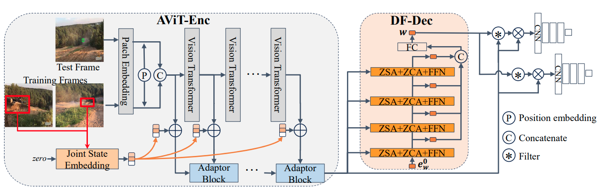
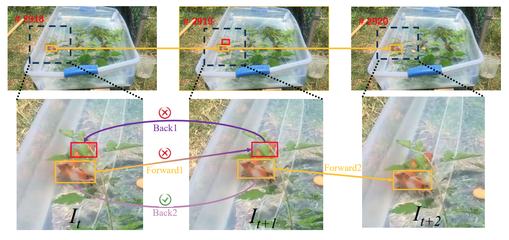

# AViTMP: A Tracking-Specific Transformer for Single-Branch Visual Tracking
Chuanming Tang, Kai Wang, Joost van de Weijer, Jianlin Zhang, Yongmei Huang
[(IEEE Transactions on Intelligent Vehicles )](https://ieeexplore.ieee.org/abstract/document/10584321)

## TL;DR
 To tackle the inferior effectiveness of the vanilla ViT, we propose an Adaptive ViT Model Prediction tracker (AViTMP) to bridge the gap between single-branch network and discriminative models. Specifically, in the proposed encoder AViT-Enc, we introduce an adaptor module and joint target state embedding to enrich the dense embedding paradigm based on ViT. Then, we combine AViT-Enc with a dense-fusion decoder and a discriminative target model to predict accurate location. Further, to mitigate the limitations of conventional inference practice, we present a novel inference pipeline called CycleTrack, which bolsters the tracking robustness in the presence of distractors via bidirectional cycle tracking verification. Lastly, we propose a dual-frame update inference strategy that adeptively handles significant challenges in long-term scenarios. 
 

<p align="center">
  
</p>

<!-- <p align="center">
     -->


| Data |      LaSOTExt   | LaSOT   | AVisT            | VOT2020     | UAV123 |    TNL2k |  TrackingNet |  OTB100 | NFS30   |
|:------------:|:-----------:|:-----------:|:-----------------:|:-----------:|:--------------:|:----------:|:---------:|:---------:|:---------:|
|  AUC   |   50.2      |    70.7     |       54.9        |    31.4    |      70.1      |    54.5    |   82.8     |   70.3   |    66.3 |


## Setup Environment
```
conda create --name pytracking --file requirements.txt
source activate pytracking
```
Or reference [pytracking](https://github.com/visionml/pytracking#installation)

```
python -c "from pytracking.evaluation.environment import create_default_local_file; create_default_local_file()"
python -c "from ltr.admin.environment import create_default_local_file; create_default_local_file()"
cd ltr
```

## Data Prapare 
1. Softlink datasets into './data', like:
```
ln -s .../lasot  .../AViTMP/data/
# datasets folder 
     |--data
        |--avist
        |--coco
        |--got10k
        |--lasot
        |--uav
        |--lasot
        |--trackingnet
        |--.......
```
2. download pretrained ViT-B model into ['./pretrained_model'](https://dl.fbaipublicfiles.com/mae/pretrain/mae_pretrain_vit_base.pth)


## Training
```
cd ltr
CUDA_VISIBLE_DEVICES=5,6,7,4  python run_training.py
# if need save the training logs into txt file. 
 nohup python -u run_training.py  >trainlog.txt 2>&1 &  
```

## Infenrence

1. copy a specific epoch and cut unnecessary parameters into './pytracking/networks/'
```
python script_cut_pth.py --epoch 300
```
2. Evalute for one-pass evaluation (OPE) datasets. 
All evaluated results are put in './tracking_results'
```
# lasot, lasot_extension_subset, avist, uav, trackingnet, nfs, otb, tnl2k.  
python run_tracker.py --dataset_name uav   --threads 4 --num_gpus 2 
```
### 3. Evalute for VOT datasets 
(Maybe a little hard to configuration, following [VOT-toolkit guidence](https://votchallenge.net/howto/) and [VOT Google group](https://groups.google.com/g/votchallenge-help). 

1. VOT2020 bbox
```
#1. env setting for VOT2020， 
vot-toolkit==0.5.3 
vot-trax==3.0.2

2. commends of evaluate. 
vot initialize  AViTMP  -workspace vot2020
vot evaluate --workspace vot2020 AViTMP
vot analysis --workspace vot2020 AViTMP 
```
Notice: If you want to evalute for VOT2020_mask or VOTS2023 (multi-object tracking \& segmentation), you should：
  1. install segmentation model [SAM-HQ](https://github.com/SysCV/sam-hq.git), installed in the same "pytracking" envirment. 
  2. combine VOT with segmentation method to build a tracking \& segmentation two-stage method.
```
Set './vot2020/run_vot.py line23 args.mask as True.
```

  ```
  # Note: env setting for VOTS2023
  vot-toolkit==0.6.4
  vot-trax==4.0.1

  # run multiple times to generate multi-target mask.
  vot initialize  AViTMP  -workspace vots2023
  vot evaluate --workspace vots2023 AViTMP
  vot analysis --workspace vots2023 AViTMP 
  ```

## Acknowledgement

Thanks for the tracking framework [PyTracking](https://github.com/visionml/pytracking) 
and [OSTrack](https://github.com/botaoye/OSTrack.git), which helps us to quickly implement our ideas.

